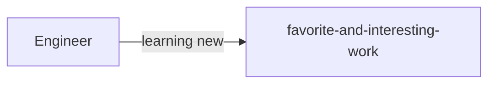

# Учебные проекты

В данном репозитории планируется размещать все учебные проекты платформ:

- Яндекс Практикум
- DLS(MIPT)
- Python-разработчик (Mail.ru) 

Стек: `PyQt, Pandas, Numpy, Scikit-learn, PyTorch, TensorFlow`

Языки: `Python, C/C++, Assembler` 

